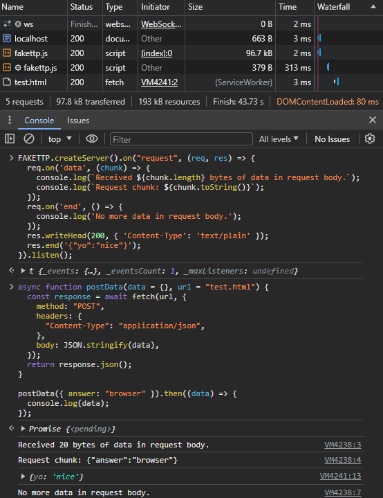
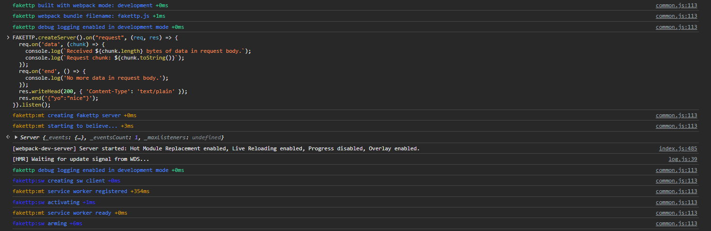
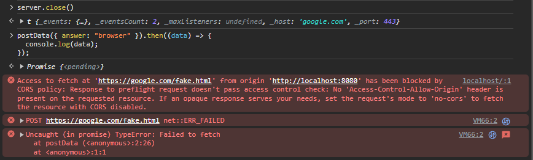

# fakettp

fake browser side http server via service workers with node api compatibility.

- [disclaimer](#disclaimer)
- [motivation](#motivation)
- [usage](#usage)
- [demo](#demo)
- [development](#development)
- [status](#status)

## disclaimer

> this is part of a security focused research project I am currently working on.
> as it usually goes for security software, this can be used for good or evil.
> this can also harm your computer or browser and cause you inconvenience.
> **I do not take any responsibility for any damages caused by this software.**
> proceed at your own risk. absolutely no warranty is provided. you may brick
> your browser if you do not know how to use this library properly.

## motivation

in building progressive web apps and performing client side testing and caching,
it is immensely helpful to have something like express or socket.io available in
order to reuse packages on npm made for various http interaction needs.

using this library in a bundler allows reuse of applications made for node.js in
terms of interaction with the core http module.

creating the http server this way does not involve a network adapter and is thus
accessible where environment is restricted. sending requests in browsers is also
local and does not involve any network adapter (including loopback).

## usage

this library is designed to be used in a bundler like [Webpack](webpack.js.org).
fakettp is a drop in replacement for node's http module. two requirements should
be met to use it in a bundler successfully:

1. alias `http` to `fakettp` in your bundler config.
2. provide fallbacks for anything else that your code may use from node core.

example webpack config:

```sh
npm install fakettp --save-dev
```

```js
module.exports = {
  resolve: {
    plugins: [
      new webpack.ProvidePlugin({
        process: "process/browser",
        Buffer: ["buffer", "Buffer"],
        URL: ["url", "URL"],
      }),
    ],
    fallback: {
      http: require.resolve("fakettp"),
      util: require.resolve("util/"),
      events: require.resolve("events/"),
      buffer: require.resolve("buffer/"),
      assert: require.resolve("assert/"),
      stream: require.resolve("stream-browserify"),
    }
  },
};
```

you can use [configuration of this repository](webpack.config.ts) as reference.

## demo

check out the examples that are known to work in [samples](./ext/samples) folder
and the [webpack config](./webpack.config.ts) for this repository.



you can create a server and listen like so:

```js
const server = FAKETTP.createServer().on("request", (req, res) => {
  req.on('data', (chunk) => {
    console.log(`Received ${chunk.length} bytes of data in request body.`);
    console.log(`Request chunk: ${chunk.toString()}`);
  });
  req.on('end', () => {
    console.log('No more data in request body.');
  });
  res.writeHead(200, { 'Content-Type': 'text/plain' });
  res.end('{"yo":"nice"}');
}).listen(443, "google.com");
```



after that all requests will be intercepted and handled by the service worker.
the host and port to watch for can be configured by passing options to `listen`.

you can for example send a request to the server like so:

```js
async function postData(data = {}, url = "https://google.com/fake.html") {
  const response = await fetch(url, {
    method: "POST",
    headers: {
      "Content-Type": "application/json",
    },
    body: JSON.stringify(data),
  });
  return response.json();
}

postData({ answer: "browser" }).then((data) => {
  console.log(data);
});
```


you can also close the server like so:

```js
server.close();
```

and if you attempt to send a request after that, you will get an error:



## development

- `npm test` to run tests.
- `npm run build` to build the project.
- `npm run serve` to start webpack dev server.
- `npm run watch` to watch for changes and rebuild.
- `npx http-serve --cors dist` to run production build.

## status

working samples:

- `ext/samples/express.ts`: express app with a dynamic route.
- `ext/samples/express-static.ts`: express app with static files.
- `ext/samples/socket-io.ts`: express app with socket io.

this is what is known to work good enough for most use cases:

- `http.createServer([options][, requestListener])` one instance per page
- `http.METHODS` through [stream-http][1]
- `http.STATUS_CODES` through [stream-http][1]
- `http.get(options[, callback])` through [stream-http][1]
- `http.get(url[, options][, callback])` through [stream-http][1]
- `http.request(options[, callback])` through [stream-http][1]
- `http.request(url[, options][, callback])` through [stream-http][1]
- class: `http.ClientRequest` through [stream-http][1]
- class: `http.Server`
  - event: `'close'`
  - event: `'connection'`
  - event: `'request'`
  - `server.close([callback])`
  - `server.listen()`
  - `server.listen(port[, host][, callback])`
  - `server.listening`
- class: `http.ServerResponse`
  - event: `'close'`
  - event: `'finish'`
  - `response.end([data][, encoding][, callback])`
  - `response.finished`
  - `response.getHeader(name)`
  - `response.getHeaderNames()`
  - `response.getHeaders()`
  - `response.hasHeader(name)`
  - `response.headersSent`
  - `response.removeHeader(name)`
  - `response.setHeader(name, value)`
  - `response.socket`
  - `response.statusCode`
  - `response.statusMessage`
  - `response.write(chunk[, encoding][, callback])`
  - `response.writeHead(statusCode[, statusMessage][, headers])`
- class: `http.IncomingMessage`
  - event: `'close'`
  - `message.complete`
  - `message.destroy([error])`
  - `message.headers`
  - `message.httpVersion`
  - `message.method`
  - `message.rawHeaders`
  - `message.socket`
  - `message.statusCode`
  - `message.statusMessage`
  - `message.url`
  - `message.connection`
- class: `net.Socket`
  - event: `'close'`
  - event: `'data'`
  - event: `'drain'`
  - event: `'end'`
  - event: `'error'`
  - `socket.address()`
  - `socket.remoteAddress`
  - `socket.remoteFamily`
  - `socket.remotePort`
  - `socket.bufferSize`
  - `socket.bytesRead`
  - `socket.bytesWritten`
  - `socket.destroy([exception])`
  - `socket.destroyed`
  - `socket.end([data][, encoding][, callback])`
  - `socket.write(data[, encoding][, callback])`

[1]: https://www.npmjs.com/package/stream-http
